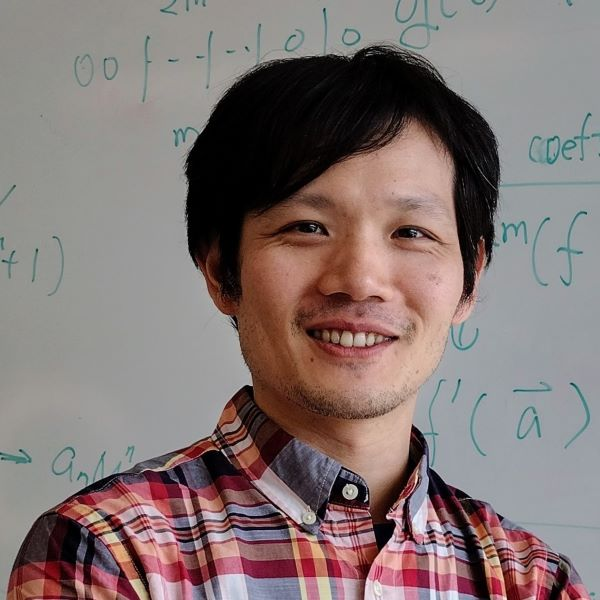

Syllabus
========

## Overview

**Course Description:**

The goal of this course is to understand the fundamental computation models in computer science.
That is, we formalize computation into theoretical models, 
and for each model, we identify essential resources.
With that, we aim to reveal the feasibilities and limitations of models and resources, for all problems.
In this course, we frequently ask and sometimes answer two questions:
1. *Can we replace one resource with a different resouce, potentially in a different model?*
2. *What are the implications of the feasibilities and limitations?*

We discuss these questions by defining computation models and their resources,
such as the time and space of Turing machines and the sizes of circuits,
and then we categorize problems into complexity classes using the models.
A main goal is to for us to understand how theoretical computer scientists
reason about these questions, 
and connecting that theory to practical questions about computing.
Another main goal is to learn the essential tools and techniques that is 
applied to solve many challenges.

<!-- 
The goal of this course is to understand the
fundamental limits on what can be efficiently computed in our
universe and other possible (or imaginary) universes. These limits
reveal deep and mysterious properties about information,
communication, and computing, as well as practical issues about how
to solve problems.

Two fundamental questions about any problem are:
 
 1. _Can it be solved using a machine of a certain type?_ (computability)
 2. _How much does it cost to solve it?_ (complexity)
 
We explore these questions by developing abstract models of computing
machines and reasoning about what they can and cannot compute
efficiently. A main goal of this course is for you to understand how
theoretical computer scientists reason about these questions, and
connecting that theory to practical questions about computing.  We
will also look at some applications in cryptography that take
advantage of problems being hard to solve, and what can be done when a
problem cannot be solved or is too expensive to solve.
 -->

**Course Objectives:** Students who complete the course will understand the following:

- Formal models of computation, such as (nondeterministic) Turing machine, alternation, circuits, and formulas.
- Resouces of the models, such as time, space, randomness, communication, and circuit size, and understand the relations between resources.
- Interactive proofs and probabilistic-checkable proofs.
- Derandomization and pseudorandomness.
- Some lower bounds and natural proofs.
<!-- 
- Improve their [mathematical thinking skill and
  habits](https://medium.com/@jeremyjkun/habits-of-highly-mathematical-people-b719df12d15e),
  including thinking precisely about definitions, stating assumptions
  carefully, critically reading arguments, and being able to write
  convincingly, and being wrong often and admit it.
- Be able to understand both finite and infinite formal models of computation and to reason about what they can and cannot compute.
- Understand both intuitively and formally what makes some problems either impossible or too expensive to solve with a computer, and what can be done in practice when an unsolvable or intractable problem is encountered.
- Reason formally about the cost of computation, and be able to prove useful bounds on the costs of solving problems, including showing that certain problems cannot be solved efficiently.
- Learn about some interesting aspects of theoretical computer science, and why understanding them matters even if you are only interested in building practical computing systems.
 -->

<!--  -->
**Class Meetings:** The meetings of the course are
  scheduled for Mondays and Wednesdays, 2--3:15pm. 

## Preparation

**Prerequisites:** To enroll in CS 6160, students must have
  completed CS 3120 (DMT2 at UVA CS) with a grade of C- or better (or an equivalent course and grade).

**Expected Background:** 
We expect students entering CS 6160 to be
comfortable reading and writing definitions, theorems, and proofs.
From the prerequisite CS 3120, we expect students to understand the Turing machine model
and basic complexity classes, such as polynomial time (P), exponential time (EXP), and NP.
We will also use basic probability, basic linear algebra, and basic algebra.

Students will be asked to turn in assignments that is typeset in LaTeX. 

## Course Staff

**Instructor:** The course is taught by [Wei-Kai Lin](https://weikailin.github.io/) (wklin-course@virginia.edu).
  Feel free to contact Wei-Kai with any
  questions about the course, computer science, or anything else you
  think I can help with.
<!-- 
  (but please read the section below on
  [communications](#communication) to determine if it would be better to post a message
  in [*Piazza*](https://piazza.com/virginia/spring2026/cs3120) before emailing us).
 -->

**Office Hours:**
<!-- The full office hours schedule is available on the [course calendar](https://calendar.google.com/calendar/embed?src=292e8ddb35fbfb071102435db2822547ef891ab66dfd7eb00e075e0ea54a45bd%40group.calendar.google.com). -->

{: style="display: block; margin: 0 auto; border-radius: 50%; max-width: 10em;"}
Office hour: Mondays, 11am - 12pm, Rice Hall 505.

## Learning Materials
    
**Textbook:** 
Sanjeev Arora and Boaz Barak, [_Computational Complexity: A Modern Approach_](https://www.cambridge.org/core/books/computational-complexity/3453CAFDEB0B4820B186FE69A64E1086).
[Draft of the book](https://theory.cs.princeton.edu/complexity/book.pdf) is available, but some chapter numbers differ.

**Additional materials:**
The book [Introduction to Theoretical Computer Science](https://introtcs.org/public/) by Boaz Barak is a good review for the prerequisites.
For the course materials, complexity is taught in many institutes, and some of them maintained high-quality lecture notes and scribes.
Here are some of them.

- Computational Complexity, Harvard, 2024, by Madhu Sudan. [A copy of timetable](assets/sudan2024-complexity_course/Sheet1.html), and [All Lecture Notes](https://drive.google.com/file/d/19OoErNeUziot3eVn7v7xp-R5mEsFTjrh/view?usp=drive_link). There are lecture notes, scribes, and HW problems. We plan to cover many topic in this course.
- Computational Complexity, UW, 2024, by Thomas Rothvoss. [Lecture notes](https://sites.math.washington.edu/~rothvoss/archive/lecturenotes/complexity-CSE531-Winter2024.pdf).
- Computational Complexity, Princeton, 2009, by Boaz Barak. [Website](https://www.cs.princeton.edu/courses/archive/spring09/cos522/). The website gives lecture notes, HW problems, and links to many materials.

For derandomization, pseudorandomness, expanders, and extractors, the book [Pseudorandomness](https://people.seas.harvard.edu/~salil/pseudorandomness/) by Salil Vadhan is the standard reference.

## Communication

We will primarily use the course website for posting course materials
and use UVA Canvas for interactive communications.

**Course Website:** We will post all course materials at
  [https://weikailin.github.io/cs6160-complexity](https://weikailin.github.io/cs6160-complexity).

In general, if you have any questions that will be relevant to other students,
please ask them on Canvas publicly.
This will get the fastest response, since all of the course
staff and students will see your question there and be able to respond to it.

**Email:**
You should use the course Canvas for questions about the course
content that are relevant to all students. If you have personal
questions or things to discuss with Wei-Kai, please do this
by emailing ([wklin-course@virginia.edu](mailto:wklin-course@virginia.edu)). 

## Coursework

### Presenting and scribing

This course aims to be interactive and requires significant class participation, particularly, reading, presenting, and discussing.
For each meeting, a *student presenter* starts the lecture with a brief high-level overview, 
or a recap in some cases; 
the presenter shall also actively ask or answer during the meeting.
After each meeting, a *scriber* shall polish and then publish his/her scribed notes.
See the details below.

The student *presenter* shall do the following:
- 1 week before the lecture: Discuss the materials of the lecture, such as book sections, lecture notes, or papers. 
- 2 days before the lecture: Finish reading materials, and post the outline or the summary of the lecture. 
- First 10 minutes of the lecture: Talk about the topics at a high level, birefly; 
  aim for 10 minutes presentation and roughly 1 minute for quick questions.
  If well-prepared and agreed in advance, the presenter can take more time.
- The remaining lecture: The instructor will talk about the topics in detail, but the student presenter shall participate in asking or answering questions.

The *scriber* shall do the following:
- Attend the lecture, and ask or answer questions.
- In a week after the lecture, typeset and turn in scribed notes.
- All scribed notes will be publicly posted on the course website.

### Written assignments

There will be optional written assignments.
Similar to many other mathematical or theoretical courses, 
most learning in this course is done by solving problems on your own and in collaboration with others.
So, written assignments were often heavy in many complexity courses (we see that in the above courses).
However, putting grades on written assignments may just incentivize copying AI solutions.
Hence, we offer problem sets and due dates, and you will get feedback later if you turn in your solutions;
there is no grades. 

### Quizzes

We have two quizzes, each is short, likely 20 minutes.
The purpose of quizzes is to assess students' progresses, so that the lectures can be fine-tuned. 
We will discuss and finalize the date and time after the semester started.

## Grading

We encourage students to spend your energy focusing on what you are
learning, instead of worrying about your grade. 

That said, we understand students are often stressed about grading and
understandably want to know how grades will be determined.  We aim to
grade in a way that is useful (provides students with accurate measure
of how well they understood what they should), motivating (encourages
the behaviors we prefer, including hard but not obsessive work), fair
(assigned higher grades to more deserving students), robust (arbitrary
small perturbations do not have a material impact on someone's grade),
and low stress (for both students and the course staff).

For this reason, we choose not to prescribe a singular mathematical
formula for quantitatively assigning letter grades but do provide a
formula that can be used to compute a _lower bound_ on the grade you
receive in the course:

| Item                      | Standard Weighting                          |
|---------------------------|---------------------------------------------|
|Presenting the lecture overview | 54%     |
|Scribing lecture notes          | 36%     |
|Quizes                     | 10%     |

With the exception of cases of academic dishonesty or inappropriate
behavior, we guarantee that you will a grade that is not below the
grade that would result from computing your score using the
percentages in the table, where your score for each item is the ratio
of the score you received to the target score for that item, and the
grading scale is based on the standard decades (e.g., 0.87 = B+, 0.9 =
A-, 0.93 = A).

This is a _minimum_ grade, though, and we generally want to assign a
grade that reflects the best possible interpretation of all you have
done during the semester. This means we consider your performance
throughout the course, and will examine grades using a variety of
different methods that weights different aspects differently and
rewards performance improvements, but also allows consistent
performance to make up for one slip-up.

An “A” grade means we are convinced that you can use the material in
this class to solve new problems and understand it well enough to
explain most concepts in the class. A “B” grade means we are convinced
that you understand the main ideas in this class well enough to be
well prepared for a follow-on course (i.e., one that has this as a
pre-requisite). See the [CS Department Grading Guidelines](https://uvacsadvising.org/policies.html#cs-department-grading-guidelines).

Although the material we cover is challenging, and the pace may seem
overwhelming at times, we are confident that all students who put
effort into this class and take good advantage of available help will
do well.

**Bonus Points.** We hope students will go beyond
the provided assignments and do other things to contribute to the
class as well as beyond. Hence, we give bonus points occasionally.
That includes (but not limited to) solving challenge problems in problem sets, 
reporting bugs in the course materials, and participating in class.
We will clearly make the bonus points in problems, but in some cases, 
it is up to the instructor's discretion.
In general, the staff reserve the right to "bump up" the grades.

## Honor Expectations

We believe strongly in the value of a community of trust, and expect
all of the students in this class to contribute to strengthening and
enhancing that community.

The course will be better for everyone if everyone can assume everyone
else is trustworthy. The course staff starts with the assumption that
all students at the university deserve to be trusted. 

**Collaboration Policy:** We believe it is important for students to
learn by thinking about problems on their own, so it is expected that
each student studies the provided materials and attempts to solve the
problems on their own. After that, you are welcome to also discuss
problems on the problem sets with students and others.

We aim to make the language describing the policy as clear
and unambiguous as possible, but if anything is ever unclear about
the stated policy for an assignment, please clarify with the course
staff. The penalty for policy violations will be considered on a
case-by-case basis, with a penalty commensurate the severity of the
offense.

## Additional Information

**Special Circumstances:** The University of Virginia strives to provide accessibility to all students. If you require an accommodation to fully access this course, please contact the Student Disability Access Center (SDAC) at (434) 243-5180 or `sdac@virginia.edu`. If you are unsure if you require an accommodation, or to learn more about their services, you may contact the SDAC at the number above or by visiting their website [https://studenthealth.virginia.edu/sdac](https://studenthealth.virginia.edu/sdac)

**Accommodations:** It is the University's long-standing policy and
  practice to reasonably accommodate students so that they do not
  experience an adverse academic consequence when serious personal
  issues conflict with academic requirements. Although University
  policy only recognizes religious accomodations, the course
  instructors believe they are many other valid reasons for
  accomdations that are at least as justifiable as ones for religious
  observance and consider family obligations, personal crises, and
  extraordinary opportunities to all be potentially valid reasons for
  accomodations.  Students who wish to request accommodations should
  submit their request to the instructor as far in
  advance as possible.

If you have questions or concerns about the University policy on
  academic accommodations for religious observance or religious
  beliefs, visit
  [https://eocr.virginia.edu/accommodations-religious-observance](https://eocr.virginia.edu/accommodations-religious-observance)
  or contact the University's Office for Equal Opportunity and Civil
  Rights (EOCR) at `UVAEOCR@virginia.edu` or 434-924-3200.

**Safe Environment:** The University of Virginia is dedicated to
  providing a safe and equitable learning environment for all
  students. To that end, it is vital that you know two values that we
  and the University hold as critically important:
 
  1. Power-based personal violence will not be tolerated. 
  2. Everyone has a responsibility to do their part to maintain a safe community on grounds (including in virtual environments).

If you or someone you know has been affected by power-based personal
violence, more information can be found on the UVA Sexual Violence
website that describes reporting options and resources available:
[https://www.virginia.edu/sexualviolence](https://www.virginia.edu/sexualviolence).
   
As your professors and as humans, know that we each care about you and
your well-being and stand ready to provide support and resources as we
can. As faculty members, we are responsible employees, which means
that we are required by University policy and federal law to report
what you tell us to the University's Title IX Coordinator. The Title
IX Coordinator's job is to ensure that the reporting student receives
the resources and support that they need, while also reviewing the
information presented to determine whether further action is necessary
to ensure survivor safety and the safety of the University
community. If you would rather keep this information confidential,
there are Confidential Employees you can talk to on Grounds (see
[https://eocr.virginia.edu/chart-confidential-resources](https://eocr.virginia.edu/chart-confidential-resources)). The
worst possible situation would be for you or your friend to remain
silent when there are so many here willing and able to help.

**Well-being:** If you are feeling overwhelmed, stressed, or isolated,
there are many individuals here who are ready and wanting to help. The
Student Health Center offers Counseling and Psychological Services
(CAPS) for all UVA students. Call 434-243-5150 (or 434-972-7004 for
after hours and weekend crisis assistance) to get started and schedule
an appointment. If you prefer to speak anonymously and confidentially
over the phone, Madison House provides a HELP Line at any hour of any
day: 434-295-8255.

<!-- 
{: .caution }
This syllabus is lightly modified after the first day of class. You may find the changes on [GitHub repo](https://github.com/weikailin/cs3120-toc). Roughly, they are:
the expected due dates of homework, 
the link to extension form.
 -->